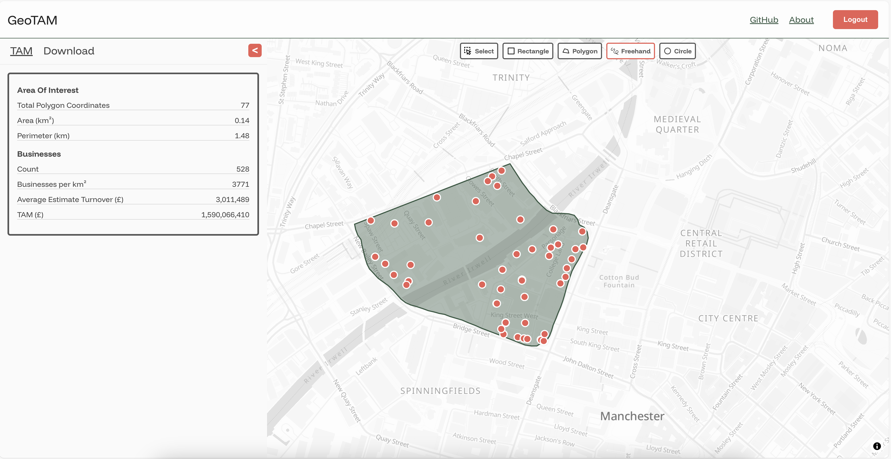

# GeoTAM

This is an application built for the [GeoTAM hackathon](https://www.rebalance.earth/geotam-challenge). The application is fullstack, built in TypeScript (JavaScript). The application provides a basic login screen, followed by the main application which allows users to draw a given area to determine the turnover of businesses in the area. The whole application is built with Open Source tools. 



## Frontend

The frontend is built using:

* Preact
* MapLibre
* Turf.js
* Terra Draw

To get started you can install:

```
npm install
```

Then run 

```
npm run build:watch
```

To start a watching build that will allow you to develop locally.

## Backend

The backend is built using:

* Nest.js
* Sequelize
* Postgres

Firstly you'll need to do an install:

```shell
npm install 
```

To get started you will need to set up your environment variables. You can create a `.env` file in the `backend` folder:

```shell
ADMIN_EMAIL=admin@example.com
ADMIN_PASSWORD=some_password_123

PG_HOST=localhost
PG_PORT=5432
PG_USER=postgres
PG_DB=geotam
PG_PASSWORD=postgres

SEED_BUSINESSES_PATH=/path/to/your/open-local-data.csv
```

You will also need to have your database set up. After this we can run the local migrations:

```
npm run db:migrate:up
npm run db:seed:up
```

Then you can start the backend app:

```shell
npm run start:dev
```

## Assets

Assets used are all open source.

### Icons

- Polygon: https://www.svgrepo.com/svg/451198/polygon - MIT Licensed
- Freehand: https://www.svgrepo.com/svg/450915/freehand - MIT Licensed
- Rectangle: https://www.svgrepo.com/svg/487711/rectangle - MIT Licensed
- Circle: https://www.svgrepo.com/svg/507597/circle - MIT Licensed
- Select: https://www.svgrepo.com/svg/449216/select - Apache

### Images

- Manchester: https://www.publicdomainpictures.net/pictures/30000/velka/bbc-buildings-salford-manchester.jpg - CC0 Public Domain

## License 

MIT Licensed